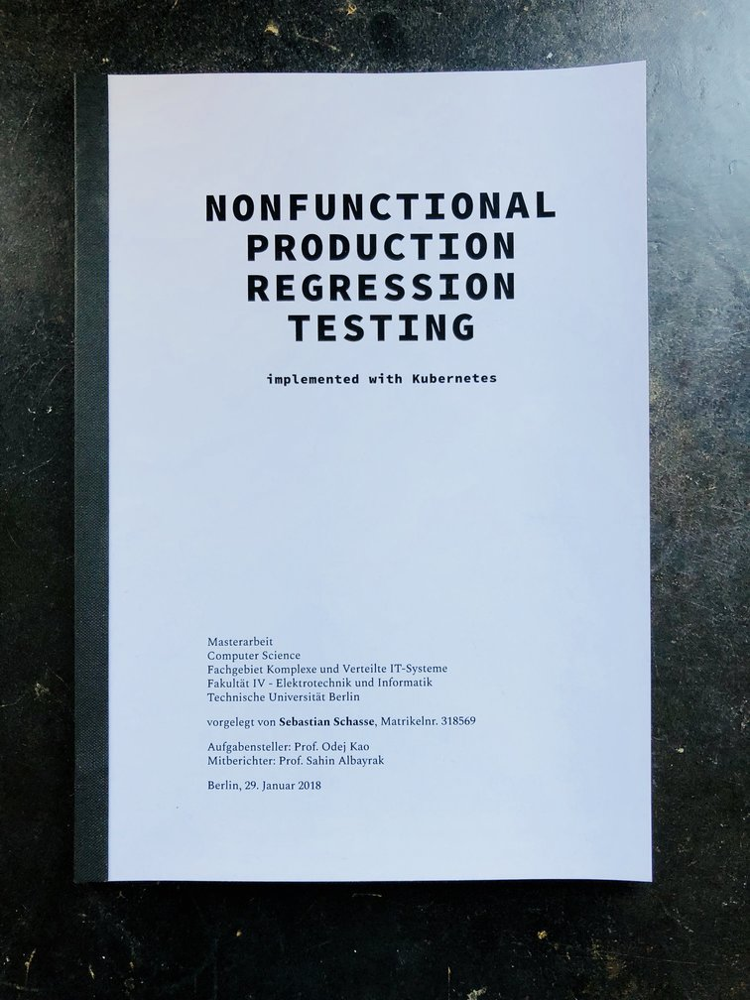
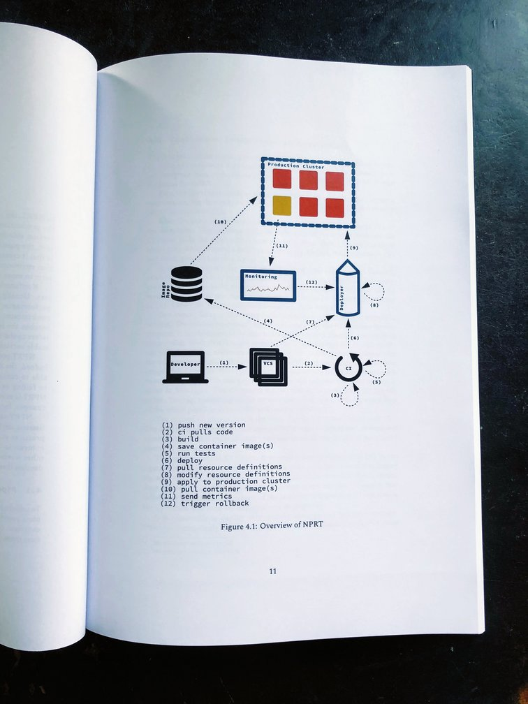

  

### Abstract

Many companies successfully use DevOps practices and microservices to
eliminate the conflicts between developers and operations
teams. Initially, the thesis explains one of the impacts of those
practices: a shift of responsibility of maintenance work from
operations to development. Developers have to maintain their own code
as well as many dependencies. Containerization technologies
consolidate this shift. A problem is that the continuous delivery
pipeline supports developers only up until the deploy and not
further. Nonfunctional Production Regression Testing (NPRT) extends
the continuous delivery pipeline to the production environment. NPRT
addresses the issue of maintenance in a continuous and fully
automatable fashion. In NPRT, a new version in the form of a canary
will be automatically deployed to production and compared to the
stable version. In case of a regression, the canary will be
automatically rolled back. In order to enable NPRT with Kubernetes, I
implemented Deployer, which connects the continuous integration system
with a monitoring system and Kubernetes. An Apache middleware, which
is used at Deutsches Institut für Normung (DIN), and a Rails
application, which GapFish develops and runs in production, served in
multiple experiments in order to evaluate NPRT for real-life use
cases.

https://github.com/gapfish/deployer

  

